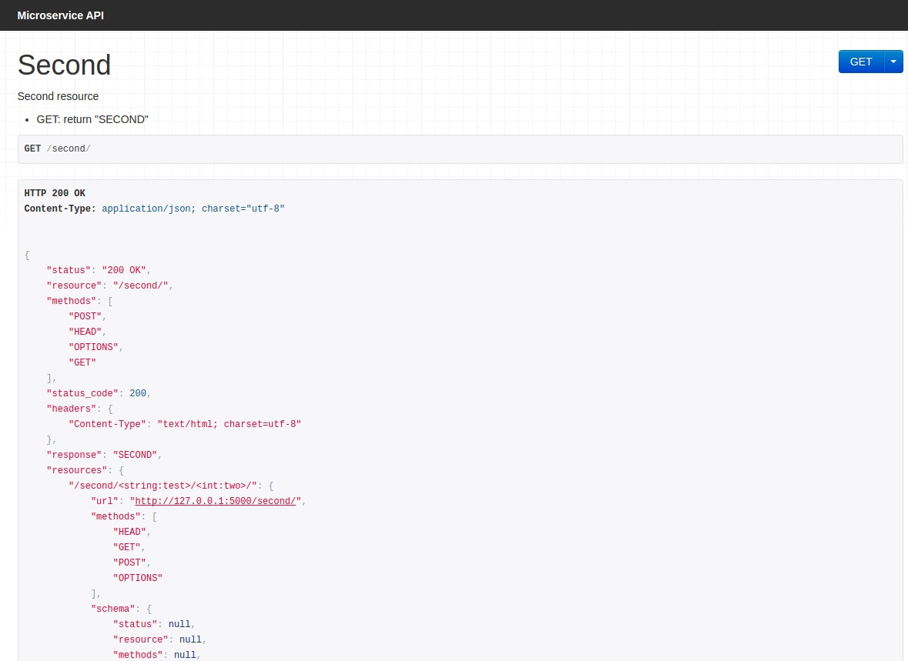

# [Microservices](https://pypi.python.org/pypi/microservices/)

**Status**: lib is under active development.

[![Build Status][travis-image]][travis-link]
[![Code Climate][codeclimate-image]][codeclimate-link]
[](https://coveralls.io/github/viatoriche/microservices?branch=master)
[![PyPI Version][pypi-image]][pypi-link]

Build microservices and client easily.

HTTP service is based on the [Browsable Web APIs for Flask](http://www.flaskapi.org)

HTTP client uses wonderful [requests](http://docs.python-requests.org/en/master/) lib 

Queues service and client are both based on [kombu](https://github.com/celery/kombu)

---

## Overview

[Microservices](https://pypi.python.org/pypi/microservices/) library provides you with helpers to create microservices and client apps.

See full documentation on [Read the Docs](http://microservices.readthedocs.io/)

Library is currently a work in progress, but all essential functions are already in place, 
so you can already start building your services with it. 
If you want to start using Microservices right now, go ahead and do so, but be sure to follow the release notes of 
new versions carefully.

HTTP implementation:


## Roadmap

Coming features in version 1.0:

* ~~SQS, AMQP and other transport protocols for microservices API.~~
* Full documentation
* Classes for services building with microservices context.

## Installation

Requirements:

* Python 2.7+ or 3.3+

Install using `pip`.

    pip install microservices

## Usage (http/rest)

Import and initialize your application (http)

    from microservices.http.service import Microservice

    app = Microservice(__main__)

## Responses

Return any valid response object as normal, or return a `list` or a `dict`.

    @app.route(
        '/example/',
        resource=Resource(),
    )
    def example():
        return {'hello': 'world'}

A renderer for the response data will be selected using content negotiation
based on the client 'Accept' header.
If you're making API request from a regular client,
this will default to a JSON response.
If you're viewing API via browser, it'll default to the browsable
API HTML.

## Requests

Access the parsed request data using `request.data`.
This will handle JSON or form data by default.

    @app.route(
        '/example/',
        resource=Resource(),
    )
    def example():
        return {'request data': request.data}

## Example

The following example demonstrates a simple API for creating,
listing, updating and deleting notes.

```python

from microservices.http.service import Microservice
from microservices.http.runners import base_run as run
from microservices.http.resources import ResourceMarker
from microservices.utils import set_logging
from flask import request, url_for

microservice = Microservice(__name__)

@microservice.route(
    '/second/',
    resource=ResourceMarker()
)
def second():
    """Second resource

    * GET: return "SECOND"
    """
    return u'SECOND'

@microservice.route(
    '/second/',
    resource=ResourceMarker(),
    methods=['POST'],
)
def second_post():
    return request.data

@microservice.route(
    '/second/<string:test>/',
    resource=ResourceMarker(
        url_params=dict(test='something'),
    ),
    methods=['POST', 'GET'],
)
def second_params(test):
    """Second resource

    * POST: return request data
    * GET: return test param
    """
    if request.method == 'POST':
        return request.data
    return test

@microservice.route(
    '/second/<string:test>/<int:two>/',
    resource=ResourceMarker(
        url=lambda resource: url_for('second', _external=True),
    ),
    methods=['POST', 'GET'],
)
def second_params_two(test, two):
    """Second resource

    * POST: return [test, two, request data]
    * GET: return [test, two]
    """
    if request.method == 'POST':
        return [test, two, request.data]
    return [test, two]

@microservice.route(
    '/',
    endpoint='Hello, world!',
    methods=['GET', 'POST'],
    resource=ResourceMarker(),
)
def hello():
    """
    Hello, world resource, testing main page

    * GET: return POST something for hello
    * POST: return request data
    """
    if request.method == 'POST':
        return request.data
    return u"POST something for hello"

if __name__ == "__main__":
    set_logging()
    run(microservice, debug=True)

```

Now you can run your microservice:

    $ python ./example.py
     * Running on http://127.0.0.1:5000/
     * Restarting with reloader

And open <http://127.0.0.1:5000/>.
You can then navigate between the notes and run `GET`, `PUT`, `POST`
and `DELETE` API requests.

Client app example:

```python
from microservices.http.client import Client
from microservices.utils import set_logging, get_logger

set_logging(level='INFO')
logger = get_logger('microservices client')

client = Client(
    'http://localhost:5000/',
)

logger.info(client.get(key='response'))
logger.info(client.post(data={'test': 'tested'}))

second_resource = client.resource('second')

logger.info(second_resource.get(key='response'))
logger.info(second_resource.post(data={'test': 'tested'}))

logger.info(second_resource.get('test', key='response'))
logger.info(second_resource.post('test'))

one_two_resource = second_resource.resource('one', '2')
logger.info(one_two_resource.get(key='response'))
logger.info(one_two_resource.post(data={'test': 'tested'}))
```

Result:

```commandline
2016-06-16 14:11:10,997 - microservices.http.client - INFO - get: http://localhost:5000/
2016-06-16 14:11:11,000 - requests.packages.urllib3.connectionpool - INFO - Starting new HTTP connection (1): localhost
2016-06-16 14:11:11,002 - microservices client - INFO - POST something for hello
2016-06-16 14:11:11,002 - microservices.http.client - INFO - post: http://localhost:5000/
2016-06-16 14:11:11,003 - requests.packages.urllib3.connectionpool - INFO - Starting new HTTP connection (1): localhost
2016-06-16 14:11:11,004 - microservices client - INFO - {u'test': u'tested'}
2016-06-16 14:11:11,004 - microservices.http.client - INFO - get: http://localhost:5000/second/
2016-06-16 14:11:11,005 - requests.packages.urllib3.connectionpool - INFO - Starting new HTTP connection (1): localhost
2016-06-16 14:11:11,006 - microservices client - INFO - SECOND
2016-06-16 14:11:11,006 - microservices.http.client - INFO - post: http://localhost:5000/second/
2016-06-16 14:11:11,007 - requests.packages.urllib3.connectionpool - INFO - Starting new HTTP connection (1): localhost
2016-06-16 14:11:11,008 - microservices client - INFO - {u'test': u'tested'}
2016-06-16 14:11:11,008 - microservices.http.client - INFO - get: http://localhost:5000/second/test/
2016-06-16 14:11:11,009 - requests.packages.urllib3.connectionpool - INFO - Starting new HTTP connection (1): localhost
2016-06-16 14:11:11,010 - microservices client - INFO - test
2016-06-16 14:11:11,010 - microservices.http.client - INFO - post: http://localhost:5000/second/test/
2016-06-16 14:11:11,011 - requests.packages.urllib3.connectionpool - INFO - Starting new HTTP connection (1): localhost
2016-06-16 14:11:11,012 - microservices client - INFO - {}
2016-06-16 14:11:11,012 - microservices.http.client - INFO - get: http://localhost:5000/second/one/2/
2016-06-16 14:11:11,012 - requests.packages.urllib3.connectionpool - INFO - Starting new HTTP connection (1): localhost
2016-06-16 14:11:11,014 - microservices client - INFO - [u'one', 2]
2016-06-16 14:11:11,014 - microservices.http.client - INFO - post: http://localhost:5000/second/one/2/
2016-06-16 14:11:11,015 - requests.packages.urllib3.connectionpool - INFO - Starting new HTTP connection (1): localhost
2016-06-16 14:11:11,016 - microservices client - INFO - {u'response': [u'one', 2, {u'test': u'tested'}]}
```

## Queues

Microservices 0.18.0+ support working with queues based on [kombu](https://github.com/celery/kombu)

Example of service usage:
```python
from microservices.queues.service import Microservice

# default uri: amqp:///
app = Microservice()

# queue name - "basic"
@app.queue('basic')
def basic_handler(payload, context):
    print(payload)

if __name__ == '__main__':
    app.run(debug=True)
```

Example of client usage:
```python
from microservices.queues.client import Client

client = Client()

queue = client.queue('basic')
queue.publish({'data': 'Hello, world'})
```

Workers and ThreadPool:
```python
from microservices.queues.service import Microservice

# Run application with 10 parallel's workers (microprocessing.pool.ThreadPool)
app = Microservice(workers=10)

```

## Credits

Many thanks to [Tom Christie](https://github.com/tomchristie/) for making the `flask_api`.

[pypi-link]: https://pypi.org/project/microservices/
[pypi-image]: https://badge.fury.io/py/microservices.svg
[travis-image]: https://travis-ci.org/viatoriche/microservices.svg?branch=master
[travis-link]: https://travis-ci.org/viatoriche/microservices
[flask-api-link]: https://github.com/tomchristie/flask-api
[codeclimate-image]: https://codeclimate.com/github/viatoriche/microservices/badges/gpa.svg
[codeclimate-link]: https://codeclimate.com/github/viatoriche/microservices
[coverage-link]: https://codeclimate.com/github/viatoriche/microservices/coverage
[coverage-image]: https://codeclimate.com/github/viatoriche/microservices/badges/coverage.svg
